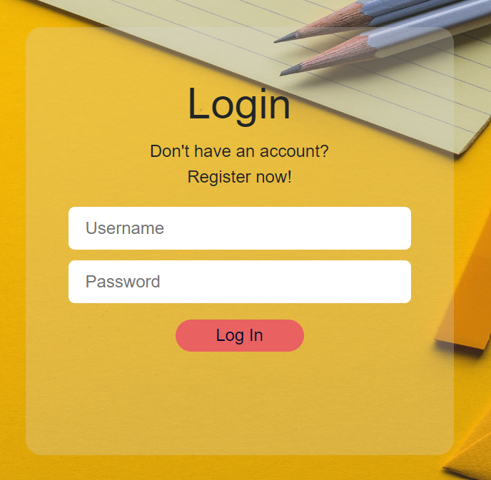
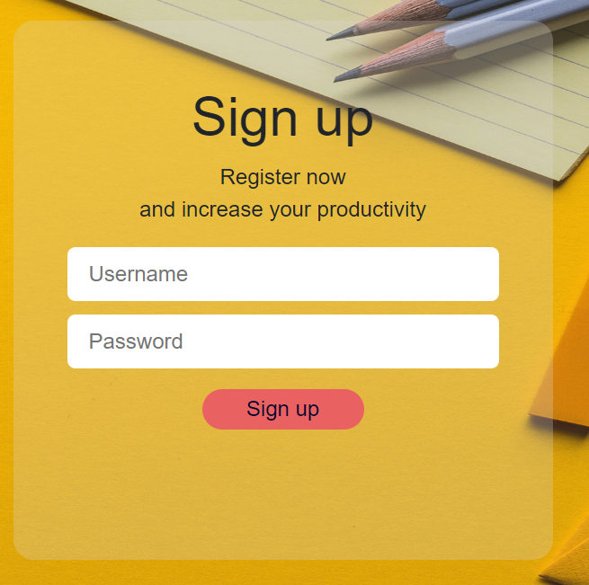
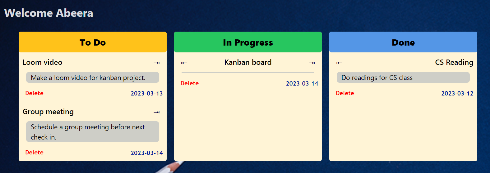

# Kanban Board

### **Description**

This is a kanban board application that allows users to create, edit and delete tasks. It has the following features:

1. To do tasks: Tasks that are yet to be done
2. In progress tasks: Tasks that are currently being worked on
3. Done tasks: Tasks that have been completed

**The app has a landing page**


**A login and a register page**

 

**The dashboard page**




### **Functionality**

The app has a landing page that allows users to create an account or login to an existing account. Once logged in, the user is redirected to the dashboard page where they can create, edit and delete tasks. The user can also logout of the application.

On the home page, there is an option to create new tasks, with the option to add a title, status, description and due date. Once a task is added it shows in one of the three sections. The user can edit the task by moving the task right or left to change the status. The user can also delete the task by clicking on the delete button.

Here is a Loom video of how to use the application:
https://www.loom.com/share/9c014ab619f241ea8cafe1059478af71

### **How to run the application**

1. Clone the repository from github

2. Create a virtual environment

```
$ python3 -m venv venv
```

3. Install the requirements

```
$ pip install -r requirements.txt
```

4. Run the application

_using flask_

```bash
$ flask --app app run --debug
```

_using python_

```bash
$ python app.py
```

### **How to run the tests**

```bash
$ python -m unittest discover
```

or

```bash
$ python test.py
```

### **References**

The structure for this application was inspired by the following tutorial:

https://flask.palletsprojects.com/en/2.2.x/tutorial/layout/
